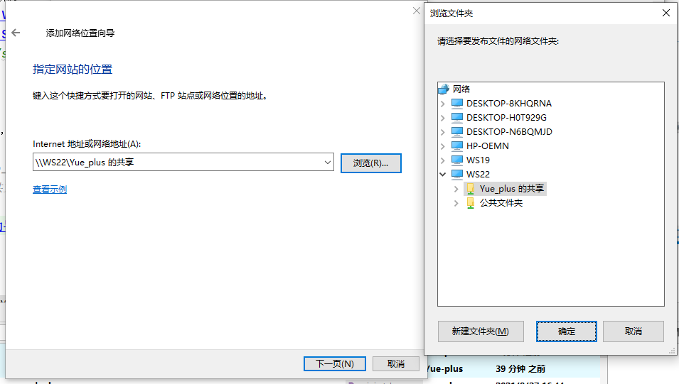

# 开始项目

## 在开始之前

确保自己的系统为 **Windows 10 专业版**


如果是 **家庭中文版** 请参考 [系统安装](/serve/base/sys_install/) 重装系统。

然后可以参考 [配置舒适的桌面环境](/serve/base/sys_config/) 。

## 本地安装 Git

<iframe src="//player.bilibili.com/player.html?aid=98007542&bvid=BV1FE411P7B3&cid=167296411&page=1" scrolling="no" border="0" frameborder="no" framespacing="0" allowfullscreen="true"  style="width: 100%; height: 380px;"> </iframe>

前往 [Git 官网](https://git-scm.com/) 下载安装包，下一步到底。

> [Git - Book（官方教程）](https://git-scm.com/book/zh/v2)
> [Git - 菜鸟教程](https://www.runoob.com/git/git-tutorial.html)

### 配置 Git

桌面右键点击 [Git Bash Here]，输入以下指令：

```sh
# "username" 为 GitHub 账号，用户名
git config --global user.name "username"

# xxxxxxxxxx@mail.com 为 GitHub 账号，注册时的用的邮箱
git config --global user.email xxxxxxxxxx@mail.com
```

### 生成自己的 SSH Key

Git Bash 终端中，输入 `ssh-keygen`

```bash {1,3-5}
$ ssh-keygen
Generating public/private rsa key pair.
Enter file in which to save the key (/c/Users/Yue_p/.ssh/id_rsa): # 直接回车
Enter passphrase (empty for no passphrase):    # 直接回车
Enter same passphrase again:                   # 直接回车
Your identification has been saved in yes
Your public key has been saved in yes.pub
The key fingerprint is:
SHA256:xuvPaGeJuufX6k4oiufALDHD7PCfZxkfXQxjCBElkCA Yue_p@DESKTOP-SQLFD1T
The key's randomart image is:
+---[RSA 3072]----+
|E ...o==..       |
| .  .  .. +      |
|         . +     |
|o      .    o    |
|=o      S. .     |
|oB    ...o.      |
|..=   .+oo.o     |
| . +.o+o=+= .    |
|  .o=oo*+B*.     |
+----[SHA256]-----+
```

现在，`<个人文件夹>/.ssh/` 中应该有 `id_rsa`（私钥）与 `id_rsa.pub`（公钥）两个文件。

## 注册 GitHub/Gitee 账号

前往<span style="color: black; background-color: black;">~~全球最大的同性交友网站~~</span>面向开源及私有软件项目的托管平台 [GitHub](https://github.com/) 注册并登入账号。

前往<span style="color: black; background-color: black;">~~全国最大的同性交友网站~~</span>云端软件开发协作平台 [Gitee](https://gitee.com/) 注册并登入账号。

前往本项目：
- GitHub 地址 <https://github.com/Yue-plus/NetNote>，点击 Watch、Star、Fork。
- Gitee 地址 <https://gitee.com/yue_plus/NetNote>，点击 Watch、Star、Fork。


## 添加 SSH Key

用 **记事本打开** `<个人文件夹>/.ssh/id_rsa.pub` 文件。

### GitHub

打开 [GitHub.com](https://github.com/) 参照以下截图添加 SSH Key：


最后点击 **[Add SSH Key]**

### Gitee

打开 [设置 -> SSH 公钥](https://gitee.com/profile/sshkeys)


## 本地安装 NodeJS

前往 [NodeJS 官网](https://nodejs.org/en/download/) 下载安装包，下一步到底。

### 安装 `cnpm`

由于国内众所周知的网络原因，推荐安装 `cnpm`，在安装依赖时代替 `npm` 命令：

```shell
npm install -g cnpm --registry=https://registry.npm.taobao.org
```

安装后可使用 `cnpm -v` 验证：

```shell {1}
$ cnpm -v
cnpm@7.0.0 (C:\Users\Yue_p\AppData\Roaming\npm\node_modules\cnpm\lib\parse_argv.js)
npm@6.14.15 (C:\Users\Yue_p\AppData\Roaming\npm\node_modules\cnpm\node_modules\npm\lib\npm.js)
node@16.8.0 (C:\Program Files\nodejs\node.exe)
npminstall@5.0.2 (C:\Users\Yue_p\AppData\Roaming\npm\node_modules\cnpm\node_modules\npminstall\lib\index.js)
prefix=C:\Users\Yue_p\AppData\Roaming\npm
win32 x64 10.0.19043
registry=https://registry.nlark.com
```

## 本地安装 Yarn

可参考 [Yarn 官网](https://yarnpkg.com/)。

在 [本地安装 NodeJS](#本地安装-nodejs) 后，在终端输入：

```bash
npm install -g yarn
```

可使用 `yarn -v` 验证安装，如果输出版本号则安装成功。

### 安装 `tyarn`

由于国内众所周知的网络原因，推荐安装 `tyarn`，在安装依赖时代替 `yarn` 命令：

```shell
npm install yarn tyarn -g
```

## 拉取项目

找一个合适的路径，执行以下指令：

```sh
# GitHub 克隆仓库（注意替换为自己的用户名：<username>）
git clone git@github.com:<username>/NetNote.git

# Gitee 克隆仓库（注意替换为自己的用户名：<username>）
git clone git@gitee.com:<username>/NetNote.git

cd NetNote

# 安装依赖
yarn
```

## 运行项目

在项目路径下执行：

```
yarn docs:dev
```

通过浏览器访问：<http://127.0.0.1:8080/>

> 更多配置可参考 **[VuePress2 介绍](https://vuepress2.netlify.app/zh/guide/)**

## 参与项目

本项目使用了 [VuePress2](https://vuepress2.netlify.app/zh/) 静态网站生成器，参考 [项目目录结构](#附-项目目录结构)
使用 [Markdown 语法](/start/markdown.html) 来编写/修改 `.md` 文件。

新建页面请参考 [默认主题配置](https://v2.vuepress.vuejs.org/zh/reference/default-theme/config.html#基础配置)
修改项目内的 `/docs/.vuepress/config.ts` 文件。

参考 [中文文案排版指北（简体中文版）](https://mazhuang.org/wiki/chinese-copywriting-guidelines/)

当前计划任务：

- 网络搭建
  + [操作手册](/net/manual/operate/)
  + [命令手册](/net/manual/command/)
- 系统服务
  + 云平台与虚拟机
    * [Hyper-V](/serve/VM/Hyper-V/)
  + [Windows Server](/serve/WS/)
  + [Linux](/serve/Linux/)

## 获取资源

在培训室内网环境，计算机右键，**添加网络位置**：

- `\\ws22\Yue_plus 的共享`
- `\\ws22\公共文件夹`



用户名：`wds`

密码：<span style="color: black; background-color: black;">Abcd1234</span>
## 部署项目

复制 `deploy.sh.examples` 文件，并重命名为 `deploy.sh` 并适当修改 `<USERNAME>/<REPO>`。

## 附：项目目录结构

当前所有文档都保存在 `NetNote\docs\` 文件夹内。

新建目录需修改 `NetNote\docs\.vuepress\config.ts` 文件。

公共图片统一放在 `NetNote\docs\.vuepress\public\img` 文件夹内。

每个文档都可以放在独立的文件夹下，维护自己的 `img` 文件夹。

::: details 目录结构
```text
文件夹 PATH 列表
卷序列号为 92AD-3B9E
C:.
├─docs
│  ├─.vuepress
│  │  ├─.cache/
│  │  ├─.temp/
│  │  └─public
│  │      └─img
│  │          ├─book
│  │          ├─other
│  │          └─portrait
│  ├─coding
│  │  ├─Docker
│  │  │  └─img
│  │  ├─Java
│  │  │  └─img
│  │  │      └─01-Path
│  │  ├─MariaDB
│  │  │  └─img
│  │  ├─Python
│  │  │  └─img
│  │  ├─RabbitMQ
│  │  │  └─img
│  │  ├─Redis
│  │  ├─Spring
│  │  │  └─Framework
│  │  │      └─WebServlet
│  │  │          └─img
│  │  └─Web
│  ├─net
│  │  ├─01-base
│  │  │  └─img
│  │  ├─acap
│  │  │  └─img
│  │  ├─manual
│  │  │  ├─command
│  │  │  │  └─img
│  │  │  │      └─07
│  │  │  └─operate
│  │  ├─router
│  │  ├─security
│  │  │  └─img
│  │  ├─switch
│  │  └─wan
│  ├─serve
│  │  ├─base
│  │  │  └─sys_install
│  │  │      └─img
│  │  ├─Linux
│  │  │  ├─01-Base
│  │  │  │  └─img
│  │  │  ├─02-Chrony
│  │  │  ├─03-NFS
│  │  │  ├─04-MariaDB
│  │  │  ├─05-Apache
│  │  │  │  └─img
│  │  │  ├─06-Tomcat
│  │  │  ├─07-Samba
│  │  │  ├─08-NIS
│  │  │  ├─09-Postfix
│  │  │  └─10-Pacemaker
│  │  ├─VM
│  │  │  ├─DCC-CRL1000
│  │  │  │  └─img
│  │  │  ├─Hyper-V
│  │  │  └─VMware
│  │  │      └─img
│  │  └─WS
│  │      ├─AD
│  │      │  └─img
│  │      │      ├─E001
│  │      │      ├─E002
│  │      │      ├─E003
│  │      │      └─E004
│  │      ├─FS
│  │      │  └─img
│  │      ├─IIS
│  │      ├─NLB
│  │      │  └─img
│  │      ├─PS
│  │      └─WDS
│  │          └─img
│  └─start
│      ├─img
│      ├─use_GitHub
│      │  └─img
│      ├─use_IDEA
│      │  └─img
│      └─use_VScode
│          └─img
└─node_modules/
```
:::

## 附：终端设置代理

### Git Bash

#### 设置代理

```sh
# http
git config --global http.proxy http://127.0.0.1:1080
git config --global https.proxy https://127.0.0.1:1080

# socks5
git config --global http.proxy 'socks5://127.0.0.1:1080'
git config --global https.proxy 'socks5://127.0.0.1:1080'
```

#### 取消代理

```sh
git config --global --unset http.proxy
git config --global --unset https.proxy
```

### PowerShell

#### 设置代理

```sh
netsh winhttp set proxy 127.0.0.1:1080
```

#### 取消代理

```sh
netsh winhttp reset proxy
```

#### 查看代理

```sh
netsh winhttp show proxy
```

## 附：Windows PowerShell 无法加载文件，因为在此系统上禁止运行脚本。

```ps
cnpm : 无法加载文件 C:\Users\Yue_plus\AppData\Roaming\npm\cnpm.ps1，因为在此系统上禁止运脚本。
有关详细信息，请参阅 https:/go.microsoft.com/fwlink/?LinkID=135170 中的 about_Execution_Policies。
所在位置 行:1 字符: 1
+ cnpm install
+ ~~~~
    + CategoryInfo          : SecurityError: (:) []，PSSecurityException
    + FullyQualifiedErrorId : UnauthorizedAccess
```


参阅 <https:/go.microsoft.com/fwlink/?LinkID=135170>

### 解决方法：

先以 **管理员身份** 在 PowerShell 中运行一下指令：

```ps
set-ExecutionPolicy RemoteSigned
```

然后就不会报错了。

## 附：没有 `telnet` 指令


### Windows 10

在 **控制面版** -> **程序** -> **程序和功能** -> **启用或关闭 Windows 功能** 中，勾选 **Telnet 客户端**：


### Windows Server

在 **服务器管理器** -> **添加角色和功能** 中，添加 **Telnet Client** 功能：


### `telnet` 指令帮助

```text
telnet [-a][-e escape char][-f log file][-l user][-t term][host [port]]
 -a      企图自动登录。除了用当前已登陆的用户名以外，与 -l 选项相同。
 -e      跳过字符来进入 telnet 客户端提示。
 -f      客户端登录的文件名
 -l      指定远程系统上登录用的用户名。
         要求远程系统支持 TELNET ENVIRON 选项。
 -t      指定终端类型。
         支持的终端类型仅是: vt100, vt52, ansi 和 vtnt。
 host    指定要连接的远程计算机的主机名或 IP 地址。
 port    指定端口号或服务名。
```

## 附：打不开微软商店 / 无法系统登入微软账号

打不开微软商店可以试试将 DNS 设为 `4.2.2.1` 和 `4.2.2.2`